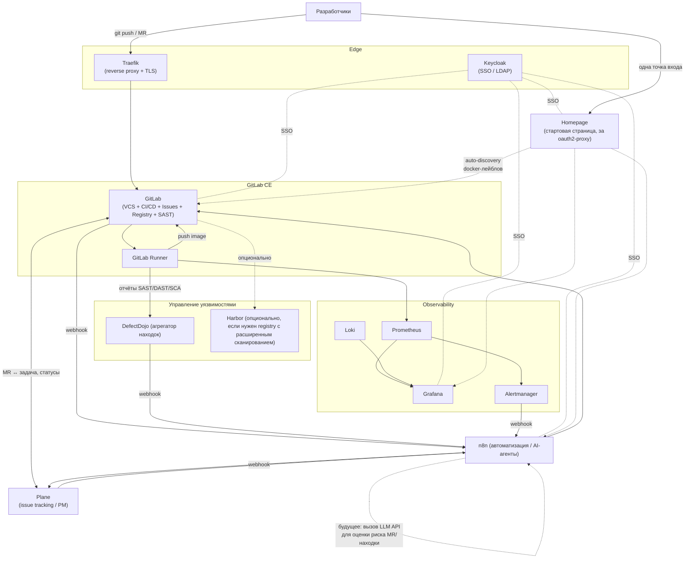

# Архитектура платформы

## Диаграмма



## Зачем именно этот набор

Все сервисы держатся на одной внешней docker-сети `devops_edge` и роутятся
через Traefik по поддоменам, чтобы:

- добавлять/выключать любой сервис независимо (модульные `docker-compose.*.yml`);
- у каждого сервиса был отдельный TLS-сертификат (Let's Encrypt через Traefik) без ручной настройки nginx;
- SSO через Keycloak не давал командам заводить отдельные учётки в каждом инструменте.

| Слой | Инструмент | Роль | Почему так |
|---|---|---|---|
| Reverse proxy / TLS | Traefik | единая точка входа, авто-TLS (wildcard через DNS-01), ip-фильтр внутренних сервисов | легче nginx+certbot в docker-окружении |
| VPN / доступ | OpenVPN на корпоративном файрволе (отдельная машина) | единственный путь к платформе; дальше — приватная сеть Hetzner | файрвол уже существует, поэтому свой VPN не заводим: он и так стоит вне платформы, а значит отказ или компрометация платформы не затрагивают точку входа — см. `network-access.md` |
| SSO | Keycloak | единый вход во все инструменты | GitLab решает это только внутри себя, здесь нужен общий слой поверх нескольких сервисов |
| VCS + CI/CD + Registry + SAST | GitLab CE | git, MR, пайплайны, container registry, встроенный SAST/dependency scanning | единственный вариант, проверенный боем именно как цельный продукт на масштабе 10-50+ разработчиков — не пришлось стыковать несколько отдельных вендоров (git-сервер + сканер) руками |
| Issue tracking / PM | Plane | эпики, roadmap, циклы (спринты), бэклог для не-технических стейкхолдеров | то, что в GitLab CE без Premium/Ultimate недоступно (эпики/roadmap/burndown платные); у Plane это бесплатно + полноценные REST API и вебхуки на каждое событие — удобно и для GitLab-интеграции, и для будущих AI-агентов (см. `adding-plane.md`) |
| Управление уязвимостями | DefectDojo | агрегация SAST/DAST/SCA отчётов из разных источников, дедупликация находок | то, что GitLab CE (без Ultimate-тарифа) не делает — единая база находок |
| Registry с расширенным сканированием | Harbor (опционально) | если штатного GitLab Container Registry + Trivy окажется мало | см. `adding-defectdojo-harbor.md` |
| Мониторинг | Prometheus/Grafana/Loki/Alertmanager | метрики, логи, алерты | стандарт де-факто, огромная экосистема экспортеров, GitLab отдаёт метрики в формате Prometheus "из коробки" |
| Автоматизация | n8n | склейка вебхуков между всеми инструментами, площадка для будущих AI-агентов | low-code, не пишем интеграционный код руками |
| Стартовая страница | Homepage + oauth2-proxy | одна точка входа во все сервисы, плитки со статусами, за Keycloak-логином | собирает сервисы сама из docker-лейблов, ~50MB RAM; свой аналог на Next.js пришлось бы поддерживать и самим закрывать хранение API-токенов (см. `dashboard-sso.md`) |

## Пример пайплайна GitLab CI с публикацией в DefectDojo

```yaml
# .gitlab-ci.yml (в репозитории конкретного проекта)
stages: [test, scan, publish]

test:
  stage: test
  script: npm ci && npm test

sast:
  stage: scan
  include:
    - template: Jobs/SAST.gitlab-ci.yml # встроенный GitLab SAST

trivy-to-defectdojo:
  stage: scan
  image: aquasec/trivy:latest
  script:
    - trivy image --format json -o trivy-report.json $CI_REGISTRY_IMAGE:$CI_COMMIT_SHA
    - >
      curl -H "Authorization: Token $DEFECTDOJO_TOKEN"
      -F "file=@trivy-report.json"
      -F "scan_type=Trivy Scan"
      -F "engagement=1"
      https://dojo.$BASE_DOMAIN/api/v2/import-scan/

publish:
  stage: publish
  script:
    - docker build -t $CI_REGISTRY_IMAGE:$CI_COMMIT_SHA .
    - docker push $CI_REGISTRY_IMAGE:$CI_COMMIT_SHA
```

`CI_REGISTRY_IMAGE` — предоставляется GitLab автоматически (встроенный
Container Registry), отдельный Harbor для этого не нужен.

## Регистрация GitLab Runner

Раннер вынесен в compose-профиль `runner` и **не стартует по умолчанию**:
токен для регистрации существует только после первого запуска GitLab, так
что автостарт приводил бы к падению контейнера в цикле.

1. Поднять core + gitlab: `./scripts/up.sh gitlab` и дождаться первого старта (3-5 минут — `docker compose logs -f gitlab` до строки `gitlab Reconfigured!`).
2. Зайти под `root`/`GITLAB_ROOT_PASSWORD` → Admin Area → CI/CD → Runners → **New instance runner**, скопировать сгенерированный токен (`glrt-...`).
3. Прописать токен в `.env` как `GITLAB_RUNNER_TOKEN` и поднять раннер:
   ```bash
   docker compose -f docker-compose.yml -f docker-compose.gitlab.yml --profile runner up -d
   ```

Регистрация выполняется один раз — при последующих рестартах контейнер
видит готовый `/etc/gitlab-runner/config.toml` и сразу переходит к работе.

## Ресурсы сервера (ориентир для 10-50 разработчиков)

| Профиль | vCPU | RAM | Диск |
|---|---|---|---|
| Минимум (core + GitLab) | 4 | 8-10 GB | 60 GB SSD |
| Рекомендуемый (+ мониторинг + автоматизация) | 6-8 | 16 GB | 150 GB SSD |
| + Plane (Postgres/Redis/RabbitMQ/MinIO + web/api/worker/live) | 10-12 | 22-24 GB | 150 GB SSD |
| + DefectDojo + Harbor поверх | 12-16 | 28-32 GB | 300+ GB SSD (registry растёт быстро) |

Plane официально заявляет минимум 2 vCPU/4GB, но это без запаса под
RabbitMQ/MinIO под реальной нагрузкой нескольких команд — закладывайте
4 vCPU/6-8GB сверх основного стека.

GitLab CE официально не рекомендуется запускать менее чем на 8GB RAM даже
для маленьких команд — при нехватке памяти чаще всего страдает Sidekiq и
фоновые джобы (просто «подвисает» без явной ошибки).
